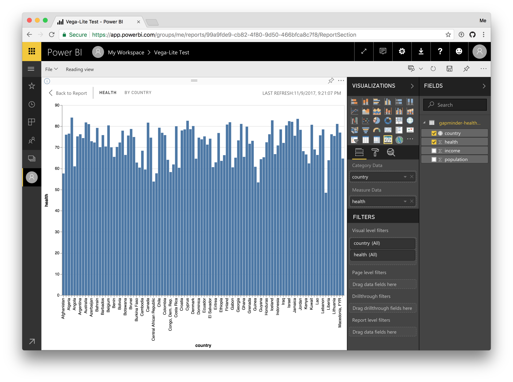

# PowerBi Custom Visual in Vega-Lite

This projects demonstrates how [Vega](vega.github.io/vega) and [Vega-Lite](vega.github.io/vega-lite) can be used in custom visuals in PowerBI. This custom visual is not intended for daily use. Think of it as a hello world for Vega and Vega-Lite in PowerBI custom visuals.

## Install

First install necessary dependencies with `npm install`.
Then run `npm run cert` and follow the instructions at https://github.com/Microsoft/PowerBI-visuals/blob/master/tools/CertificateAddOSX.md.

## Run

Run `npm start` in a terminal.

The open PowerBI with developer mode enabled and create a developer visual.

## Update Vega

PowerBI uses a secure iframe that disallows access to certain variables on the `window` variable. Vega reads the device pixel ratio to render visualizations on a canvas with the correct resolution. Since the variable is not available, we currenlty have to patch Vega so that it does not access it.

To do so, run `cp node_modules/vega/build/vega.js libs/vega.js` then replace the access to `window.devicePixelRatio` with a constant (e.g. `2`).

## Contributing

This project welcomes contributions and suggestions.  Most contributions require you to agree to a Contributor License Agreement (CLA) declaring that you have the right to, and actually do, grant us the rights to use your contribution. For details, visit https://cla.microsoft.com.

When you submit a pull request, a CLA-bot will automatically determine whether you need to provide a CLA and decorate the PR appropriately (e.g., label, comment). Simply follow the instructions provided by the bot. You will only need to do this once across all repos using our CLA.

This project has adopted the [Microsoft Open Source Code of Conduct](https://opensource.microsoft.com/codeofconduct/).
For more information see the [Code of Conduct FAQ](https://opensource.microsoft.com/codeofconduct/faq/) or
contact [opencode@microsoft.com](mailto:opencode@microsoft.com) with any additional questions or comments.
